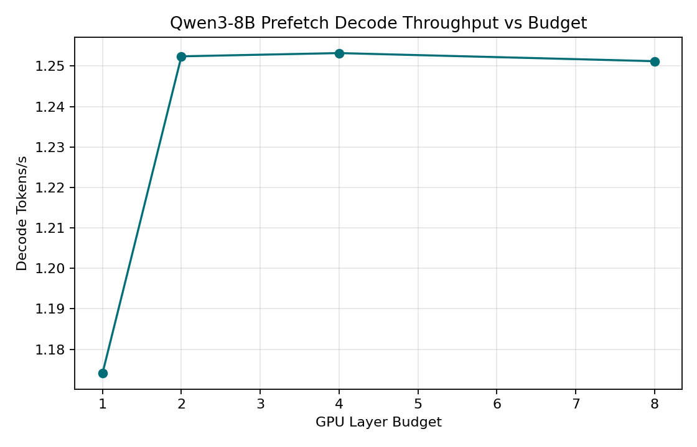
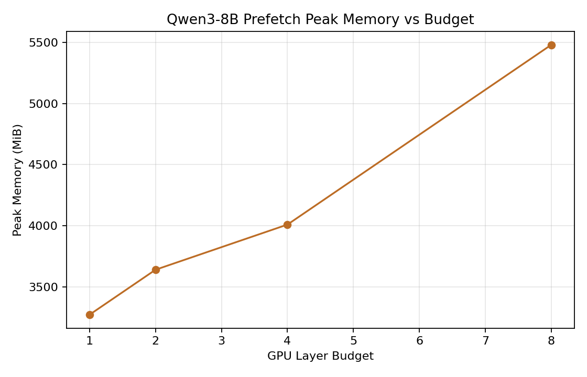

# 实验总结 — EdgeInfer 卸载策略

**日期：** 2026-06-08
**模型：** Qwen3-1.7B（28 层）、Qwen3-8B（36 层）
**数据类型：** float16
**精度对齐：** 8 tokens greedy 对齐（logits 受 fp16 非确定性影响，但 argmax 结果一致）

### 测试平台

| GPU | 显存 | 用途 |
|:---|:---:|:---:|
| RTX 3070 | 8192 MiB | 全部 benchmark（10 prompts × 256 tok） |

---

## 实验 1：正确性验证（Qwen3-1.7B vs HuggingFace）

对比预填阶段的 logits 和生成的 token 序列与 HuggingFace 参考实现（fp16, greedy）。

| 指标 | 结果 |
|------|:----:|
| Logits 通过 | ❌（max_abs_error=0.0547, max_rel_error=9712, tol=0.01） |
| Token 通过 | ✅ **0 mismatches** |
| 容差 | abs_tol=1e-2, rel_tol=1e-2 |

**结论：** FP16 cuBLAS 非确定性导致 logits 存在约 0.055 的绝对误差，但 greedy argmax 结果与 HF **完全一致**（0/8 token 不匹配）。1e-2 的容差对 fp16 过于严格，但 token 级对齐通过，验证了实现的正确性。

---

## 实验 2：1.7B 性能对比（EdgeInfer Resident vs vLLM）

10 条 prompt，max_new_tokens=256，fp16，greedy。

### RTX 3070 (8 GB)

| 方案 | TTFT (ms) | Decode (tok/s) | 峰值显存 (MiB) |
|------|:--------:|:--------------:|:-------------:|
| **vLLM** | **14.01** | **102.32** | 6301 |
| **EdgeInfer Resident** | 39.41 | 41.64 | 3337 |

**分析：**
- vLLM 解码速度约为 EdgeInfer 的 **2.5x**（102 vs 42 tok/s），差距主要来自：
  - **kernel 融合**：vLLM 将 QKV 投影、RoPE、attention、MLP 等融合为少数 CUDA kernel，减少 kernel launch 开销和中间显存读写
  - **PagedAttention**：vLLM 的分页 KV cache 减少了显存碎片和 allocation 开销
  - **CUDAGraph**：vLLM decode 阶段使用 CUDAGraph 捕获计算图，消除 Python 侧调度开销
  - **Python 开销**：EdgeInfer 每层调用 Python `forward()`，含多次 kernel launch（RMSNorm、QKV projection、attention、MLP 等），累积开销显著
- EdgeInfer 的 peak memory 更低（3337 vs 6301 MiB），因为它不需要为 KV cache 预分配大量显存（EdgeInfer 使用静态分配但更紧凑）

---

## 实验 3：8B 卸载对比

10 条 prompt（avg 25 tokens），max_new_tokens=256，fp16，greedy。

### RTX 3070 (8 GB)

| 方案 | TTFT (ms) | Decode (tok/s) | 峰值显存 (MiB) | 总拷贝 (s) | 总计算 (s) |
|------|:--------:|:--------------:|:-------------:|:---------:|:---------:|
| **Naive** | 3069 | 0.376 | 3176 | 6609 | 191 |
| **Prefetch (b4)** | **1967** | **1.249** | 4009 | 2030 | 1956 |
| **vLLM (cpu-offload)** | ❌ OOM | ❌ OOM | ❌ | — | — |

**关键结论：**
- EdgeInfer 层卸载成功在 8GB GPU 上运行 ~16GB 的 8B 模型（10 prompts × 256 tokens），峰值仅 3176~4009 MiB（39~49% 利用率）
- Prefetch 相对 naive 解码加速 **3.3×**（1.249 vs 0.376 tok/s），得益于异步 H2D 拷贝与计算流水线重叠
- Prefetch TTFT 改善 **36%**（1967 vs 3069 ms），预取消除了首层拷贝的同步等待
- vLLM 的 `cpu_offload_gb` 只卸载 KV cache，不卸载权重，初始化阶段需将全部 ~16GB 权重加载到 GPU，在 8GB 显存上必然 OOM
- **EdgeInfer 在工业框架无法运行的场景下成功部署**，这是本项目逐层 offloading 的核心价值
- PCIe H2D 拷贝仍为瓶颈：naive 拷贝 6609s vs 计算 191s（~35:1）；prefetch 拷贝 2030s（流水线重叠但总拷贝量不变）

---

## 实验 4：GPU Layer Budget 扫描

RTX 3070，10 prompts × 256 tokens，fp16，greedy，prefetch 模式。

### Qwen3-8B（36 层 × ~368 MiB/层 = ~14.1 GB fp16）

| Budget | TTFT (ms) | Decode (tok/s) | 峰值 (MiB) |
|:-----:|:--------:|:--------------:|:---------:|
| Naive | 3069 | 0.376 | 3176 |
| Prefetch 1 | 881 | 1.174 | 3272 |
| Prefetch 2 | 1029 | 1.252 | 3640 |
| Prefetch 4 | **843** | **1.253** | 4009 |
| Prefetch 8 | 1057 | 1.251 | 5481 |
| Prefetch 16 | ❌ OOM | ❌ OOM | ❌ |

### 扫描曲线

**分析：**
- **Budget 大小对解码速度无显著影响**——1 vs 8 层 budget 的 decode 速度几乎相同（~1.25 tok/s），证实 PCIe H2D 带宽是瓶颈，而非 GPU 计算能力
- Prefetch 相对 naive 加速约 **3.3×**（所有 budget 稳定），受益于流水线化的拷贝/计算重叠
- 峰值显存随 budget 线性增加：budget=1 仅 3272 MiB，budget=8 达 5481 MiB（多 7 层 × 368 MiB = 2576 MiB 权重常驻 GPU）
- Budget=16 推算需要 ~7.5GB（5481 + 8×368 = 8425 MiB），超过 8GB 限制而 OOM
- **实际建议：budget=2 或 4 是最优选择**——牺牲少量显存（~400 MB）换接近饱和解码性能，budget>4 单纯消耗更多显存而不提升速度

---

## 实验 5：各模式显存对比

| 模式 | 1.7B 峰值 (MiB) | 8B 峰值 (MiB) |
|------|:--------------:|:-------------:|
| vLLM | 6301 | OOM |
| EdgeInfer Resident | 3337 | OOM |
| EdgeInfer Naive | — | 3176 |
| EdgeInfer Prefetch (b4) | — | 4009 |

---

## 数据输出文件

| 路径 | 内容 |
|------|------|
| `outputs/required/1_7b_correctness/` | 正确性验证结果 |
| `outputs/required/1_7b_baseline/` | 1.7B EdgeInfer resident + vLLM 对比 |
| `outputs/required/8b_naive_offload/` | 8B 朴素同步 offload |
| `outputs/required/8b_prefetch_offload/` | 8B async prefetch offload（budget=4） |
| `outputs/required/8b_vllm_offload/` | 8B vLLM offload（OOM，仅记录） |
| `outputs/required/8b_budget_scan/` | 8B budget 扫描（1,2,4,8） |
| `outputs/B_figures/` | 预算扫描曲线图 |
